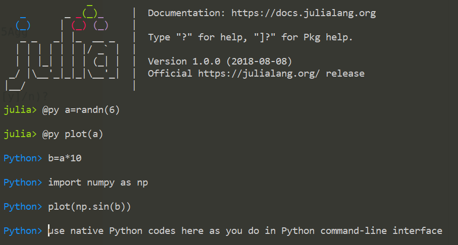

# Use Python REPL in Julia

## Installation
Firstly, make sure PyCall.jl work well, then
`(v1.0) pkg> add https://github.com/229668880/Python.jl.git`

## Usage

Python.jl is only based on PyCall.jl, and help to use Python native codes freely (include plotting with matplotlib) in Julia REPL or provide Python REPL as you do in Python command-line interface. Python.jl will work properly if Pycall.jl works well with Python. It doesn't need any more installation and configuration.

Run `using Python` and start Python at backend, then:

1. __Julia REPL__: use macro `@py python_codes` to run Python codes, or `@py variable_name` to show the value of a variable in Python. Since PyCall.jl has been imported, you can embed `py"a"` in any codes to use the value of `a` which is created in Python by `@py a=100`, e.g. `py"a"*1000` in Julia REPL.

2. __Python REPL__: type `Ctrl+)` in empty `julia>` to enter Python REPL, and input any Python codes as you do in in Python command-line interface. You can switch back to Julia REPL by `backspace`.

3. __Transfer data between two REPL__: In Julia REPL, you can use `@pyput a b` to put variables a and b into Python backend, and use `@pyget c d` to get variables c and d from Python. In Python REPL, `@jlget e f` can be used to get variables e and f from Julia backend, and `@jlput g h` to transfer variables g and h from Python REPL to Julia. Please note that introducing new variables will overwrite existed variables with the same names.

4. __Plotting__: After `using Python` initializes, Python codes `from matplotlib.pylab import *` and `import matplotlib.pyplot as plt` have been executed in Python backend,so you can plot with typing`plot(randn(100))`. Plotting functionalities are only based on PyCall.jl, independent of PyPlot.jl, and  let you plot freely as in IPython. Python.jl works well with Qt5, and maybe need `show()` function to display plotting window for unknown reason.

**Note:**
If plotting doesn't work, try to `pip3 install pyqt5` and make sure Qt5 is your plotting backend in Python.

## Requirements

### Julia

* PyCall.jl

### Python

* Any version of Python that makes PyCall.jl work properly.

